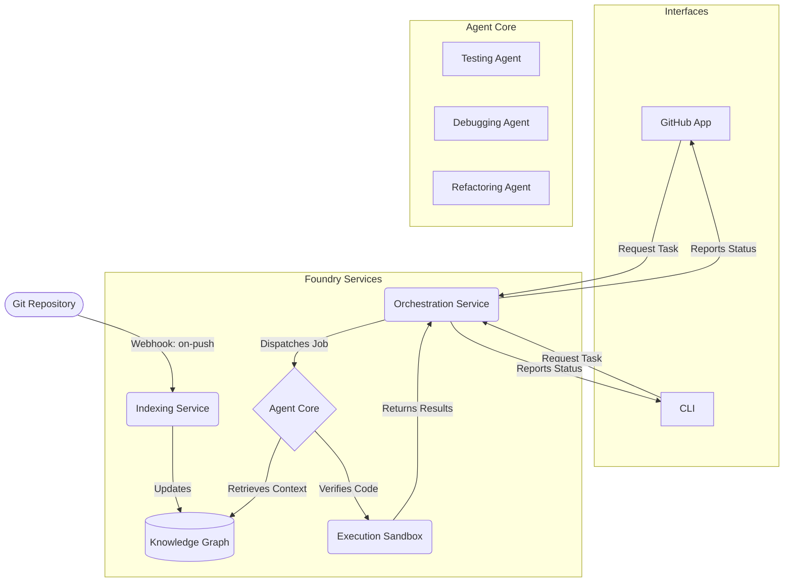

# The AI Software Foundry

An autonomous software engineering platform that continuously analyzes, tests, and improves your codebase. It acts as an integrated AI team member, ensuring code quality and reliability across the entire development lifecycle.

## Features

-   **Continuous Integration & Learning**: Hooks directly into your Git repository, learning from every commit and keeping its understanding of your code perpetually up-to-date.
-   **Scales to Any Size**: Built on a Retrieval-Augmented Generation (RAG) and micro-agent architecture, it handles million-line codebases with ease.
-   **Intelligent Impact Analysis**: When a change is made, it precisely identifies the affected parts of the system and intelligently scopes its work, saving massive amounts of time and compute.
-   **Autonomous Generate-Verify-Heal Loop**: It doesn't just write code; it compiles it, runs it in a secure sandbox, analyzes failures, and autonomously fixes bugs in either the tests or the source code itself.
-   **Multi-Agent Specialization**: Employs a team of specialized AI agents for testing, debugging, refactoring, and documentation to ensure expert-level quality at every step.
-   **Seamless SDLC Integration**: Interacts with developers through GitHub pull requests, Slack notifications, and a powerful CLI.

## How It Works: The Foundry Lifecycle

The Foundry operates as a collection of persistent, communicating services that integrate directly into your development workflow.

1.  **Continuous Learning**: The **Indexing Service** listens for `git push` events. On every commit, it performs an *incremental* analysis, updating a vector-based **Knowledge Graph** that serves as the Foundry's central memory.
2.  **Task Initiation**: A developer initiates a task, for example by commenting `@AIFoundry test this PR` on a pull request.
3.  **Intelligent Orchestration**: The **Orchestration Service** receives the request. It first performs an **Impact Analysis** by querying the Knowledge Graph to determine exactly what needs to be tested.
4.  **Specialized Agent Execution**: The Orchestrator dispatches sub-tasks to the appropriate agent in the **Agent Core**. The **Testing Agent** uses RAG to retrieve necessary context and generate test code.
5.  **Sandboxed Verification**: The generated code is sent to the **Execution Sandbox**, a secure, scalable environment where it is compiled and run.
6.  **The Heal Loop**: If verification fails, a "debug" task is created. The **Debugging Agent** analyzes the failure, queries the Knowledge Graph for context, and generates a code patch. The patched code is then sent back for re-verification. This loop continues until the suite passes.
7.  **Reporting**: The final result—a passed test suite, a code review with suggestions, or an updated documentation file—is reported back to the developer through the original interface (e.g., a comment on the PR).

This architecture ensures that the Foundry is not just a one-shot tool, but a true, scalable, and reliable AI partner in the software development process.