# code2test

## **Core Philosophy: "Pragmatic Intelligence with Zero Waste"**

This architecture combines:
- **Specification-driven generation** (tests what SHOULD happen)
- **Code-aware validation** (understands what DOES happen)
- **Incremental healing** (fixes only what's broken)
- **Tool orchestration** (leverages existing solutions)
- **Fact-based generation** (zero hallucination)

---

## **System Architecture: The Complete Intelligent Flow**

The system is built around a stateful, incremental execution engine that orchestrates a series of intelligent nodes to generate, validate, and self-heal test cases.

### **Implemented Core Components (Phase 2 & 3)**

| Component | Node | Function | Status |
| :--- | :--- | :--- | :--- |
| **Multi-Tool Smart Router** | `MultiToolRouterNode` | Selects the optimal test generation strategy (e.g., prompt, confidence target) based on test case priority and context. | **Implemented** |
| **Multi-Layer Quality Gate** | `QualityGateNode` | Validates generated test code against quality criteria (e.g., length, confidence) *before* execution to prevent wasted sandbox runs. | **Implemented** |
| **Surgical Healing System** | `HealNode` | Attempts to fix failing tests by generating and applying a minimal, targeted unified diff patch to the source code. | **Implemented** |
| **Human-in-the-Loop** | `HumanInTheLoopNode` | Escalates unresolvable failures (e.g., Quality Gate failure, failed healing attempt) for manual review and override. | **Implemented** |
| **Continuous Learning Engine** | `LearningEngineNode` | Processes the final outcome of each test case to inform and refine future generation strategies. | **Implemented** |
| **Reporting** | `FinalizeAndOrganizeNode` | Generates the final `quality_report.md` and `audit_trail.md` documents. | **Implemented** |

### **Execution Flow**

The single test execution flow is a robust, self-correcting pipeline:

`Route -> Generate -> QualityGate -> Verify (Initial) -> [Failure] -> Heal -> Verify (Healed) -> [Failure] -> HumanInTheLoop -> Learn`

---

## **System Architecture Diagram**

```mermaid
graph TD
    %% === STYLES ===
    classDef input fill:#e8f5e8,stroke:#4caf50,stroke-width:3px;
    classDef intelligent fill:#e3f2fd,stroke:#2196f3,stroke-width:3px;
    classDef existing fill:#fff3e0,stroke:#ff9800,stroke-width:2px;
    classDef novel fill:#f3e5f5,stroke:#9c27b0,stroke-width:3px;
    classDef healing fill:#ffebee,stroke:#f44336,stroke-width:2px;
    classDef output fill:#e0f2f1,stroke:#009688,stroke-width:3px;
    classDef state fill:#fce4ec,stroke:#e91e63,stroke-width:2px;

    %% === INPUT LAYER ===
    subgraph "📝 Multi-Source Truth"
        UserStories["📋 Business Requirements"]:::input
        TechnicalSpecs["📄 Technical Specifications"]:::input
        ExistingAssets["💻 Existing Assets"]:::input
    end

    %% === INTELLIGENCE LAYER ===
    subgraph "🧠 Multi-Modal Intelligence Engine"
        FactExtractor["Fact Extraction Engine"]:::intelligent
        CrossValidator["Cross-Source Validator"]:::intelligent
        StrategyOrchestrator["Intelligent Strategy Orchestrator"]:::intelligent
    end

    %% === PROVEN TOOLS LAYER (Simplified) ===
    subgraph "🛠️ Tool Ecosystem"
        Copilot["GitHub Copilot"]:::existing
        Hypothesis["Hypothesis PBT"]:::existing
        StaticAnalysis["Static Analysis"]:::existing
    end

    %% === NOVEL COORDINATION LAYER (Implemented) ===
    subgraph "🎭 Smart Orchestration (Implemented)"
        MultiToolRouter["Multi-Tool Smart Router"]:::novel
        QualityGate["Multi-Layer Quality Gate"]:::novel
        HumanLoop["Human-in-the-Loop Controller"]:::novel
    end

    %% === HEALING LAYER (Implemented) ===
    subgraph "🏥 Surgical Healing System (Implemented)"
        ErrorAnalyzer["AI-Powered Error Analyzer"]:::healing
        SurgicalHealer["Surgical Patch Generator"]:::healing
        LearningEngine["Continuous Learning Engine"]:::healing
    end

    %% === INCREMENTAL STATE LAYER ===
    subgraph "📊 Stateful Execution Engine"
        TestChecklist["Smart Test Checklist"]:::state
        ExecutionEngine["Incremental Execution Engine"]:::novel
        PatchDatabase["Patch Knowledge Base"]:::state
    end

    %% === OUTPUT LAYER (Implemented) ===
    subgraph "📦 Production-Ready Deliverables"
        TestSuite["Self-Documenting Test Suite"]:::output
        QualityReport["Comprehensive Quality Report"]:::output
        AuditTrail["Complete Audit Trail"]:::output
    end

    %% === CONNECTIONS ===
    
    %% Input to Intelligence
    UserStories --> FactExtractor
    ExistingAssets --> FactExtractor
    FactExtractor --> CrossValidator
    CrossValidator --> StrategyOrchestrator
    
    %% Intelligence to Orchestration
    StrategyOrchestrator --> MultiToolRouter
    
    %% Orchestration to Tools/Healing
    MultiToolRouter --> Copilot
    MultiToolRouter --> Hypothesis
    Copilot --> QualityGate
    Hypothesis --> QualityGate
    
    %% Quality Gate to Execution/Escalation
    QualityGate --> ExecutionEngine
    QualityGate --> HumanLoop
    
    %% Execution Loop
    ExecutionEngine --> TestChecklist
    TestChecklist --> ErrorAnalyzer
    ErrorAnalyzer --> SurgicalHealer
    SurgicalHealer --> ExecutionEngine
    
    %% Final Outcomes
    ExecutionEngine --> TestSuite
    ExecutionEngine --> LearningEngine
    HumanLoop --> LearningEngine
    
    %% Reporting
    LearningEngine --> QualityReport
    LearningEngine --> AuditTrail
    
    %% State Persistence
    TestChecklist -.->|"Persistent State"| PatchDatabase
    SurgicalHealer -.->|"Patch Results"| PatchDatabase
```



---

## **Expected Performance Metrics**

```yaml
Technical Success Rates:
  unit_tests: 
    target: 90%
    market_baseline: 70% (Copilot alone)
    our_hybrid: 90% (multi-tool + healing)
    
  integration_tests:
    target: 75%
    market_baseline: 45%
    our_hybrid: 75%
    
  edge_case_coverage:
    target: 95%
    market_baseline: 60%
    our_hybrid: 95% (property-based testing)

Quality Metrics:
  false_positive_rate: <3%
  test_maintenance_overhead: <10%
  citation_coverage: 100%
  business_requirement_coverage: >90%

Business Impact:
  time_to_80_percent_coverage:
    manual: 2-4 weeks
    our_system: 4-6 hours
    
  developer_productivity_gain: 400%
  bug_escape_rate_reduction: 60%
  test_maintenance_cost_reduction: 75%

Cost Efficiency:
  infrastructure_cost: $800/month
  developer_time_saved: $80K/month (10-person team)
  roi: 12,000% within 6 months
```

---
