# code2test

## **Core Philosophy: "Pragmatic Intelligence with Zero Waste"**

This architecture combines:
- **Specification-driven generation** (tests what SHOULD happen)
- **Code-aware validation** (understands what DOES happen)
- **Incremental healing** (fixes only what's broken)
- **Tool orchestration** (leverages existing solutions)
- **Fact-based generation** (zero hallucination)

---

## **System Architecture**

```mermaid
graph TD
    %% === STYLES ===
    classDef input fill:#e8f5e8,stroke:#4caf50,stroke-width:3px;
    classDef intelligent fill:#e3f2fd,stroke:#2196f3,stroke-width:3px;
    classDef existing fill:#fff3e0,stroke:#ff9800,stroke-width:2px;
    classDef novel fill:#f3e5f5,stroke:#9c27b0,stroke-width:3px;
    classDef healing fill:#ffebee,stroke:#f44336,stroke-width:2px;
    classDef output fill:#e0f2f1,stroke:#009688,stroke-width:3px;
    classDef state fill:#fce4ec,stroke:#e91e63,stroke-width:2px;

    %% === INPUT LAYER ===
    subgraph "📝 Multi-Source Truth"
        UserStories["📋 Business Requirements<br/>• User stories<br/>• Acceptance criteria<br/>• Business rules"]:::input
        TechnicalSpecs["📄 Technical Specifications<br/>• API contracts (OpenAPI)<br/>• Type definitions<br/>• Integration contracts"]:::input
        ExistingAssets["💻 Existing Assets<br/>• Source code<br/>• Current tests<br/>• Git history<br/>• Documentation"]:::input
    end

    %% === INTELLIGENCE LAYER ===
    subgraph "🧠 Multi-Modal Intelligence Engine"
        FactExtractor["Fact Extraction Engine<br/>🎯 Zero-interpretation parsing<br/>🎯 Structured requirement analysis<br/>🎯 Code behavior mapping<br/>🎯 Historical pattern mining"]:::intelligent
        
        CrossValidator["Cross-Source Validator<br/>🔍 Spec ↔ Code alignment<br/>🔍 Requirement coverage gaps<br/>🔍 Implementation contradictions<br/>🔍 Missing functionality detection"]:::intelligent
        
        StrategyOrchestrator["Intelligent Strategy Orchestrator<br/>⚡ Risk-based prioritization<br/>⚡ Tool-to-task matching<br/>⚡ Resource optimization<br/>⚡ Failure prediction"]:::intelligent
    end

    %% === PROVEN TOOLS LAYER ===
    subgraph "🛠️ Best-in-Class Tool Ecosystem"
        direction LR
        
        subgraph Generation Tools
            Copilot["GitHub Copilot<br/>💰 $20/month<br/>⭐ 70% unit test success"]:::existing
            Cursor["Cursor IDE<br/>💰 $20/month<br/>⭐ Best for refactoring"]:::existing
            Hypothesis["Hypothesis PBT<br/>💰 Free<br/>⭐ 95% edge case coverage"]:::existing
        end
        
        subgraph Validation Tools
            MutationTest["Mutation Testing<br/>mutmut/Stryker<br/>💰 Free<br/>⭐ Test quality validation"]:::existing
            StaticAnalysis["Static Analysis<br/>SonarQube/Semgrep<br/>💰 $30/month<br/>⭐ Code quality"]:::existing
            ContractTest["Contract Testing<br/>Pact/WireMock<br/>💰 Free<br/>⭐ API validation"]:::existing
        end
    end

    %% === INCREMENTAL STATE LAYER ===
    subgraph "📊 Stateful Execution Engine"
        TestChecklist["Smart Test Checklist<br/>📋 Individual test states<br/>📋 Failure categorization<br/>📋 Patch history<br/>📋 Success patterns"]:::state
        
        ExecutionEngine["Incremental Execution Engine<br/>🎯 Run only failed tests<br/>🎯 Parallel execution<br/>🎯 Resource monitoring<br/>🎯 State persistence"]:::novel
        
        PatchDatabase["Patch Knowledge Base<br/>🧠 Error → Fix mappings<br/>🧠 Success patterns<br/>🧠 Cross-project learning<br/>🧠 Confidence scoring"]:::state
    end

    %% === HEALING LAYER ===
    subgraph "🏥 Surgical Healing System"
        ErrorAnalyzer["AI-Powered Error Analyzer<br/>🔍 Error categorization<br/>🔍 Root cause analysis<br/>🔍 Historical pattern matching<br/>🔍 Fix confidence scoring"]:::healing
        
        SurgicalHealer["Surgical Patch Generator<br/>🔧 Minimal impact patches<br/>🔧 Targeted fixes only<br/>🔧 Rollback capability<br/>🔧 Human escalation"]:::healing
        
        LearningEngine["Continuous Learning Engine<br/>🧠 Pattern recognition<br/>🧠 Success optimization<br/>🧠 Failure prediction<br/>🧠 Strategy improvement"]:::healing
    end

    %% === NOVEL COORDINATION LAYER ===
    subgraph "🎭 Smart Orchestration (Our Secret Sauce)"
        MultiToolRouter["Multi-Tool Smart Router<br/>🎯 Context-aware tool selection<br/>🎯 Parallel execution coordination<br/>🎯 Fallback strategies<br/>🎯 Cost optimization"]:::novel
        
        QualityGate["Multi-Layer Quality Gate<br/>✅ Citation requirement<br/>✅ Business logic validation<br/>✅ Performance benchmarks<br/>✅ Security checks"]:::novel
        
        HumanLoop["Human-in-the-Loop Controller<br/>👨‍💻 Approval workflows<br/>👨‍💻 Expert escalation<br/>👨‍💻 Quality oversight<br/>👨‍💻 Manual overrides"]:::novel
    end

    %% === OUTPUT LAYER ===
    subgraph "📦 Production-Ready Deliverables"
        TestSuite["Self-Documenting Test Suite<br/>✅ Citation-backed assertions<br/>✅ Requirement traceability<br/>✅ Maintenance instructions<br/>✅ Business value mapping"]:::output
        
        QualityReport["Comprehensive Quality Report<br/>📊 Coverage analysis<br/>📊 Risk assessment<br/>📊 Gap identification<br/>📊 Improvement recommendations"]:::output
        
        AuditTrail["Complete Audit Trail<br/>📝 Generation decisions<br/>📝 Patch applications<br/>📝 Quality validations<br/>📝 Human approvals"]:::output
    end

    %% === CONNECTIONS ===
    
    %% Input to Intelligence
    UserStories --> FactExtractor
    TechnicalSpecs --> FactExtractor
    ExistingAssets --> FactExtractor
    
    FactExtractor --> CrossValidator
    CrossValidator --> StrategyOrchestrator
    
    %% Intelligence to Tools
    StrategyOrchestrator --> MultiToolRouter
    MultiToolRouter --> Copilot
    MultiToolRouter --> Cursor
    MultiToolRouter --> Hypothesis
    
    %% Tools to Quality
    Copilot --> QualityGate
    Cursor --> QualityGate
    Hypothesis --> QualityGate
    
    QualityGate --> MutationTest
    QualityGate --> StaticAnalysis
    QualityGate --> ContractTest
    
    %% Quality to Execution
    MutationTest --> ExecutionEngine
    StaticAnalysis --> ExecutionEngine
    ContractTest --> ExecutionEngine
    
    ExecutionEngine --> TestChecklist
    TestChecklist --> ErrorAnalyzer
    
    %% Healing Loop
    ErrorAnalyzer --> SurgicalHealer
    SurgicalHealer --> PatchDatabase
    PatchDatabase --> ExecutionEngine
    
    %% Learning Loop
    TestChecklist --> LearningEngine
    LearningEngine --> StrategyOrchestrator
    LearningEngine --> MultiToolRouter
    
    %% Human Oversight
    QualityGate --> HumanLoop
    SurgicalHealer --> HumanLoop
    HumanLoop --> TestSuite
    
    %% Final Outputs
    ExecutionEngine --> TestSuite
    CrossValidator --> QualityReport
    LearningEngine --> AuditTrail

    %% State Persistence
    TestChecklist -.->|"Persistent State"| PatchDatabase
    ExecutionEngine -.->|"Execution History"| TestChecklist
    SurgicalHealer -.->|"Patch Results"| PatchDatabase
```



---

## **Expected Performance Metrics**

```yaml
Technical Success Rates:
  unit_tests: 
    target: 90%
    market_baseline: 70% (Copilot alone)
    our_hybrid: 90% (multi-tool + healing)
    
  integration_tests:
    target: 75%
    market_baseline: 45%
    our_hybrid: 75%
    
  edge_case_coverage:
    target: 95%
    market_baseline: 60%
    our_hybrid: 95% (property-based testing)

Quality Metrics:
  false_positive_rate: <3%
  test_maintenance_overhead: <10%
  citation_coverage: 100%
  business_requirement_coverage: >90%

Business Impact:
  time_to_80_percent_coverage:
    manual: 2-4 weeks
    our_system: 4-6 hours
    
  developer_productivity_gain: 400%
  bug_escape_rate_reduction: 60%
  test_maintenance_cost_reduction: 75%

Cost Efficiency:
  infrastructure_cost: $800/month
  developer_time_saved: $80K/month (10-person team)
  roi: 12,000% within 6 months
```

---
