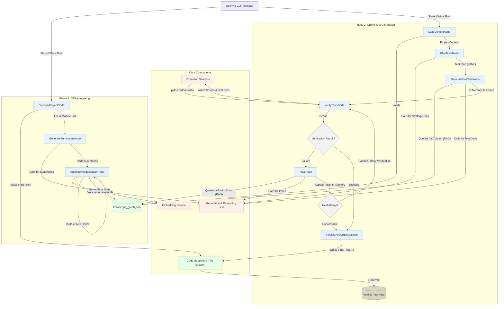

### Architecture Diagram

### How to Read the Diagram

1.  **Phase 1: Offline Indexing (Top-Left)**: This workflow is run once to learn about the codebase.
    *   It starts by **discovering** source files.
    *   It then **summarizes** each function/class using an LLM.
    *   Finally, it **builds the knowledge graph** by creating vector embeddings of the summaries and saves the result to `knowledge_graph.json`.

2.  **Phase 2: Online Test Generation (Top-Right)**: This workflow uses the knowledge graph to autonomously generate and fix tests.
    *   It **loads** the context from the `knowledge_graph.json` file.
    *   The **`PlanTestsNode`** creates a high-level strategy.
    *   The **`GenerateUnitTestsNode`** uses Retrieval-Augmented Generation (RAG) to query the knowledge graph for relevant context and prompts the LLM to write test code.
    *   The **`VerifyTestsNode`** runs the generated code in a secure **Sandbox**.
    *   **The Healing Loop**:
        *   If verification **fails**, the **`HealNode`** is activated. It uses the error message to query the knowledge graph for context, generates a patch, and applies it in-memory.
        *   The flow then loops back to the **`VerifyTestsNode`** to try again with the patched code.
        *   If verification **succeeds**, the flow proceeds to the final step.
    *   The **`FinalizeAndOrganizeNode`** takes the successfully verified (and potentially patched) test files and writes them to the disk.