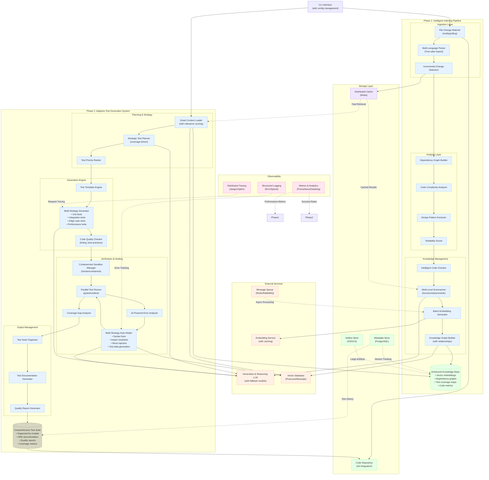

### Architecture Diagram

## **Major Enhancements**

### **1. Scalability & Performance**
- **Distributed Vector Database**: Replaced file-based storage with proper vector DB (Pinecone/Weaviate)
- **Caching Layer**: Added Redis for frequent queries and intermediate results
- **Message Queues**: Async processing for heavy operations like embedding generation
- **Containerized Sandboxes**: Better isolation and resource management

### **2. Intelligence & Context Awareness**
- **Incremental Updates**: Only reprocess changed files instead of full rebuilds
- **Multi-Level Analysis**: Dependency graphs, complexity metrics, testability scoring
- **Smart Context Loading**: Relevance scoring for better RAG retrieval
- **Coverage-Driven Planning**: Strategic test generation based on coverage gaps

### **3. Reliability & Error Handling**
- **Multi-Strategy Healing**: Different healing approaches for different error types
- **Fallback Models**: LLM redundancy for reliability
- **Quality Gates**: Code quality checks before execution
- **Parallel Processing**: Better resource utilization

### **4. Observability & Monitoring**
- **Structured Logging**: Better debugging and audit trails
- **Metrics Collection**: Performance and success rate monitoring
- **Distributed Tracing**: End-to-end request tracking
- **Quality Reports**: Comprehensive test suite analytics

### **5. Production Readiness**
- **Proper Data Persistence**: PostgreSQL for metadata, S3/GCS for artifacts
- **Git Integration**: Version control awareness
- **Configuration Management**: Environment-specific settings
- **Documentation Generation**: Self-documenting test suites

## **Key Architectural Principles**

1. **Separation of Concerns**: Clear boundaries between ingestion, analysis, generation, and verification
2. **Async Processing**: Non-blocking operations for better UX
3. **Caching Strategy**: Multiple cache layers for different access patterns
4. **Fault Tolerance**: Graceful degradation and recovery mechanisms
5. **Extensibility**: Plugin architecture for different languages and test frameworks

This architecture is much more suitable for production use and can handle enterprise-scale codebases while maintaining the core AI-driven test generation capabilities.