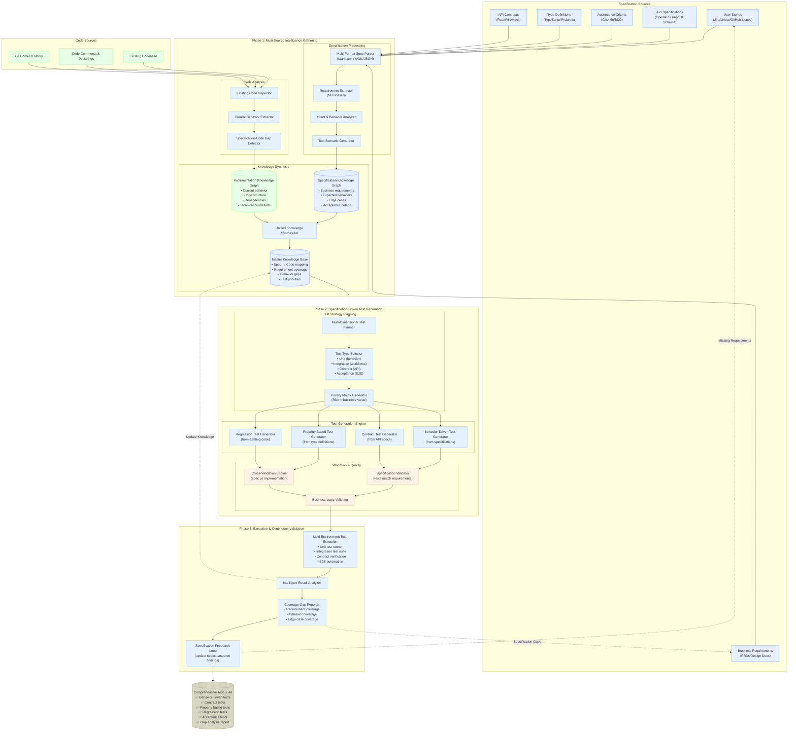

## **Specification-Based Generation (The Better Approach)**

**What this would look like:**
- Generate tests from requirements, user stories, API specs, design docs
- Focus on **behavioral correctness** rather than implementation details
- Test what the system **should do**, not what it **currently does**

Let me show you an enhanced architecture that does both:



## **Key Differences in This Specification-Driven Approach**

### **1. Multiple Input Sources**
Instead of just analyzing code, we analyze:
- **User Stories**: "As a user, I want to create an account so I can save my preferences"
- **API Specs**: OpenAPI definitions with expected inputs/outputs
- **Business Requirements**: "Email validation must follow RFC 5322 standard"
- **Acceptance Criteria**: "Given invalid email, when user submits, then show error message"

### **2. Behavior-First Test Generation**

**Example: User Registration Feature**

**From Specification:**
```yaml
user_story: "User can register with email and password"
acceptance_criteria:
  - "Email must be valid format"
  - "Password must be 8+ characters"
  - "Duplicate emails are rejected"
  - "Success returns user ID"
  - "Failure returns specific error"
```

**Generated Tests:**
```python
# Behavior-driven (from spec)
def test_user_registration_with_valid_data():
    """Test: User can successfully register with valid email and password"""
    result = register_user("john@example.com", "password123")
    assert result.success == True
    assert result.user_id is not None
    assert result.email == "john@example.com"

def test_user_registration_rejects_invalid_email():
    """Test: System rejects registration with invalid email format"""
    result = register_user("invalid-email", "password123")
    assert result.success == False
    assert "invalid email format" in result.error_message

def test_user_registration_rejects_duplicate_email():
    """Test: System prevents duplicate email registration"""
    # First registration succeeds
    register_user("john@example.com", "password123")
    
    # Second registration with same email fails
    result = register_user("john@example.com", "differentpass")
    assert result.success == False
    assert "email already exists" in result.error_message
```

### **3. Cross-Validation Between Spec and Code**

The system can identify mismatches:

```python
# Specification says: "Password must be 8+ characters"
# But code implementation only checks for 6+ characters

def validate_password(password):
    return len(password) >= 6  # ❌ Doesn't match spec!

# System generates test that would FAIL:
def test_password_length_requirement():
    """Test: Password must be at least 8 characters (per spec)"""
    result = register_user("john@example.com", "short")  # 5 chars
    assert result.success == False  # This will PASS, revealing the bug!
```

### **4. Gap Detection and Missing Functionality**

```python
# Specification mentions "password reset functionality"
# But no code exists for it yet

# System generates:
def test_password_reset_with_valid_email():
    """Test: User can reset password with valid email"""
    result = request_password_reset("john@example.com")
    assert result.success == True
    assert result.reset_token is not None
    # This test will FAIL, indicating missing implementation
```

## **Hybrid Approach: Best of Both Worlds**

The enhanced architecture does **both**:

### **For New Features (Spec-First)**
1. **Input**: User stories, requirements, API specs
2. **Generate**: Behavior-driven tests that define expected functionality
3. **Outcome**: Tests that guide implementation (TDD approach)

### **For Existing Code (Code-First)**
1. **Input**: Existing codebase
2. **Generate**: Regression tests and characterization tests
3. **Outcome**: Safety net for refactoring

### **For Legacy Modernization (Gap Analysis)**
1. **Input**: Both specifications and existing code
2. **Analyze**: What's implemented vs. what should be implemented
3. **Generate**: Tests for missing functionality + regression tests
4. **Outcome**: Roadmap for bringing code in line with specs

## **Real-World Example**

**Scenario**: You have a payment processing system

**Inputs:**
```yaml
# From business requirements
requirements:
  - "Process credit card payments"
  - "Support multiple currencies"
  - "Handle payment failures gracefully"
  - "Comply with PCI DSS"

# From API specification  
api_spec:
  endpoint: "/api/payments"
  method: "POST"
  required_fields: ["amount", "currency", "card_token"]
  response_codes: [200, 400, 402, 500]

# From existing code
current_implementation:
  - "Only handles USD"
  - "Basic card processing"
  - "No retry logic"
  - "Limited error handling"
```

**Generated Test Strategy:**
1. **Specification Tests**: Multi-currency support, PCI compliance, proper error codes
2. **Regression Tests**: Current USD processing continues to work
3. **Gap Tests**: Tests for missing currency support (will initially fail)
4. **Contract Tests**: API response format matches specification

This approach gives you **comprehensive coverage** that includes both "what exists" and "what should exist," helping you build robust, specification-compliant software.