# Incremental Test Healing System

```mermaid
graph TD
    %% === STYLES ===
    classDef process fill:#e6f2ff,stroke:#b3d9ff,stroke-width:2px;
    classDef datastore fill:#e6ffe6,stroke:#b3ffb3,stroke-width:2px;
    classDef external fill:#fff0e6,stroke:#ffccb3,stroke-width:2px;
    classDef finaloutput fill:#d6d6c2,stroke:#b8b894,stroke-width:2px;
    classDef decision fill:#f2f2f2,stroke:#cccccc,stroke-width:2px;
    classDef stateful fill:#f0e6ff,stroke:#d9b3ff,stroke-width:3px;
    classDef patch fill:#ffe6e6,stroke:#ffb3b3,stroke-width:2px;

    %% === PHASE 1: INITIAL GENERATION ===
    subgraph Phase 1: Initial Test Generation from Specs
        direction TB
        
        SpecAnalyzer["Specification Analyzer"]:::process
        TestSpecGenerator["Test Specification Generator"]:::process
        
        TestPlanFile[("test_plan.yaml<br/>📋 Test checklist<br/>📋 Expected behaviors<br/>📋 Success criteria<br/>📋 Dependencies")]:::stateful
        
        InitialCodeGen["Initial Test Code Generator"]:::process
        
        BaselineTests[("Generated Test Suite<br/>🧪 test_user_service.py<br/>🧪 test_payment_flow.py<br/>🧪 test_auth_middleware.py")]:::datastore
    end

    %% === PHASE 2: STATEFUL EXECUTION TRACKING ===
    subgraph Phase 2: Incremental Execution & State Tracking
        direction TB
        
        TestExecutor["Incremental Test Executor"]:::process
        
        subgraph Execution State Management
            TestStateDB[("Test Execution State<br/>✅ test_create_user_valid: PASSED<br/>❌ test_create_user_invalid: FAILED<br/>⏳ test_create_user_edge: PENDING<br/>🔄 test_create_user_mock: RETRY(2/3)")]:::stateful
            
            ExecutionLog[("Execution History<br/>📊 Attempt #1: 5/10 passed<br/>📊 Attempt #2: 7/10 passed<br/>📊 Current: 8/10 passed<br/>📝 Failure patterns<br/>📝 Success patterns")]:::stateful
            
            FailureAnalysisDB[("Failure Analysis Store<br/>🔍 Error categorization<br/>🔍 Root cause mapping<br/>🔍 Fix success rates<br/>🔍 Pattern recognition")]:::stateful
        end
        
        StateManager["Test State Manager<br/>(Git-like commit system)"]:::process
    end

    %% === PHASE 3: INTELLIGENT PATCH GENERATION ===
    subgraph Phase 3: Surgical Patch Generation
        direction TB
        
        FailureAnalyzer["Smart Failure Analyzer"]:::process
        PatternMatcher["Historical Pattern Matcher"]:::process
        
        subgraph Patch Strategies
            SyntaxPatcher["Syntax Error Patcher<br/>(imports, indentation)"]:::patch
            MockPatcher["Mock & Fixture Patcher<br/>(dependency injection)"]:::patch
            DataPatcher["Test Data Patcher<br/>(realistic test data)"]:::patch
            LogicPatcher["Test Logic Patcher<br/>(assertion fixes)"]:::patch
            EnvironmentPatcher["Environment Patcher<br/>(setup/teardown)"]:::patch
        end
        
        PatchValidator["Patch Impact Validator<br/>(ensures no regression)"]:::process
        PatchApplier["Incremental Patch Applier<br/>(Git-style diff application)"]:::process
    end

    %% === PHASE 4: CONTINUOUS REFINEMENT ===
    subgraph Phase 4: Continuous Learning & Refinement
        direction TB
        
        SuccessTracker["Success Pattern Tracker"]:::process
        FailurePredictor["Failure Predictor<br/>(ML-based risk assessment)"]:::process
        
        KnowledgeBase[("Learning Knowledge Base<br/>🧠 Successful patch patterns<br/>🧠 Error → Fix mappings<br/>🧠 Code → Test strategies<br/>🧠 Context → Success predictors")]:::stateful
        
        AdaptiveGenerator["Adaptive Test Generator<br/>(learns from history)"]:::process
    end

    %% === CORE WORKFLOW ===
    CLI["CLI: test-gen heal --incremental"]

    %% Phase 1 connections
    CLI --> SpecAnalyzer
    SpecAnalyzer --> TestSpecGenerator
    TestSpecGenerator --> TestPlanFile
    TestPlanFile --> InitialCodeGen
    InitialCodeGen --> BaselineTests

    %% Phase 2 connections  
    BaselineTests --> TestExecutor
    TestExecutor --> TestStateDB
    TestExecutor --> ExecutionLog
    TestStateDB --> StateManager
    ExecutionLog --> StateManager

    %% Phase 3 connections
    TestStateDB --> FailureAnalyzer
    ExecutionLog --> FailureAnalyzer
    FailureAnalyzer --> PatternMatcher
    PatternMatcher --> SyntaxPatcher
    PatternMatcher --> MockPatcher
    PatternMatcher --> DataPatcher
    PatternMatcher --> LogicPatcher
    PatternMatcher --> EnvironmentPatcher

    SyntaxPatcher --> PatchValidator
    MockPatcher --> PatchValidator
    DataPatcher --> PatchValidator
    LogicPatcher --> PatchValidator
    EnvironmentPatcher --> PatchValidator

    PatchValidator --> PatchApplier
    PatchApplier --> BaselineTests
    
    %% Phase 4 connections
    TestStateDB --> SuccessTracker
    SuccessTracker --> KnowledgeBase
    ExecutionLog --> FailurePredictor
    FailurePredictor --> KnowledgeBase
    KnowledgeBase --> AdaptiveGenerator
    AdaptiveGenerator --> PatternMatcher

    %% Feedback loops
    PatchApplier -.->|"Updated Tests"| TestExecutor
    StateManager -.->|"State Checkpoint"| TestStateDB
    FailureAnalysisDB -.->|"Historical Context"| PatternMatcher

    %% === FINAL OUTPUT ===
    FinalTestSuite[("Incrementally Perfected Test Suite<br/>✅ 9/10 tests passing<br/>📈 Continuous improvement<br/>🔄 Minimal regeneration<br/>📊 Full audit trail")]:::finaloutput
    
    PatchApplier --> FinalTestSuite
```




## 🎯 **Step 1: Initial Generation with Checklist**

Instead of generating monolithic test files, we create:

### **test_plan.yaml** (The "Checklist")
```yaml
test_suite: "UserService"
target_coverage: 90%
generated_at: "2025-08-04T10:30:00Z"

test_cases:
  - id: "test_create_user_valid_email"
    status: "PENDING"
    priority: "HIGH"
    description: "Create user with valid email should succeed"
    expected_behavior: "Returns User object with ID"
    dependencies: ["Database", "EmailValidator"]
    retry_count: 0
    last_error: null
    
  - id: "test_create_user_invalid_email" 
    status: "PENDING"
    priority: "HIGH"
    description: "Create user with invalid email should fail"
    expected_behavior: "Raises ValidationError"
    dependencies: ["EmailValidator"]
    retry_count: 0
    last_error: null
    
  - id: "test_create_user_duplicate_email"
    status: "PENDING" 
    priority: "MEDIUM"
    description: "Create user with existing email should fail"
    expected_behavior: "Raises DuplicateUserError"
    dependencies: ["Database"]
    retry_count: 0
    last_error: null

  - id: "test_create_user_with_weak_password"
    status: "PENDING"
    priority: "LOW"
    description: "Weak password should be rejected"
    expected_behavior: "Raises WeakPasswordError"
    dependencies: ["PasswordValidator"]
    retry_count: 0
    last_error: null

execution_history:
  - attempt: 1
    timestamp: "2025-08-04T10:35:00Z"
    passed: 0
    failed: 0
    pending: 4
    
patterns_learned: []
successful_patches: []
```

### **Initial Generated Test File**
```python
# test_user_service.py (Version 1.0)
import pytest
from user_service import UserService

class TestUserService:
    
    def test_create_user_valid_email(self):
        """Create user with valid email should succeed"""
        service = UserService()
        user = service.create_user("john@example.com", "password123")
        assert user.id is not None
        assert user.email == "john@example.com"
    
    def test_create_user_invalid_email(self):
        """Create user with invalid email should fail"""
        service = UserService() 
        with pytest.raises(ValidationError):
            service.create_user("invalid-email", "password123")
    
    def test_create_user_duplicate_email(self):
        """Create user with existing email should fail"""
        service = UserService()
        service.create_user("john@example.com", "password123")  # First user
        with pytest.raises(DuplicateUserError):
            service.create_user("john@example.com", "different123")  # Duplicate
    
    def test_create_user_with_weak_password(self):
        """Weak password should be rejected"""
        service = UserService()
        with pytest.raises(WeakPasswordError):
            service.create_user("john@example.com", "123")
```

---

## 🧪 **Step 2: First Execution - Track Individual Failures**

**Run Command:**
```bash
test-gen execute --incremental --track-state
```

**Execution Results:**
```
✅ test_create_user_valid_email: PASSED
❌ test_create_user_invalid_email: FAILED - ImportError: No module named 'ValidationError'
❌ test_create_user_duplicate_email: FAILED - Database connection error
❌ test_create_user_with_weak_password: FAILED - ImportError: No module named 'WeakPasswordError'
```

**Updated test_plan.yaml:**
```yaml
test_cases:
  - id: "test_create_user_valid_email"
    status: "PASSED" ✅
    last_success: "2025-08-04T10:35:15Z"
    
  - id: "test_create_user_invalid_email"
    status: "FAILED"
    retry_count: 1
    last_error: "ImportError: No module named 'ValidationError'"
    error_category: "IMPORT_ERROR"
    
  - id: "test_create_user_duplicate_email"
    status: "FAILED"
    retry_count: 1  
    last_error: "Database connection error"
    error_category: "ENVIRONMENT_ERROR"
    
  - id: "test_create_user_with_weak_password"
    status: "FAILED"
    retry_count: 1
    last_error: "ImportError: No module named 'WeakPasswordError'"
    error_category: "IMPORT_ERROR"

execution_history:
  - attempt: 1
    timestamp: "2025-08-04T10:35:15Z"
    passed: 1  # ✅ Don't touch the passing test!
    failed: 3
    pending: 0
```

---

## 🔧 **Step 3: Surgical Patch Generation**

Instead of regenerating everything, we create **targeted patches**:

### **Patch 1: Fix Import Errors**
```yaml
patch_id: "patch_001_import_fixes"
target_tests: ["test_create_user_invalid_email", "test_create_user_with_weak_password"]
patch_type: "IMPORT_FIX"
changes:
  - operation: "add_import"
    line: 2
    content: "from user_service.exceptions import ValidationError, WeakPasswordError"
```

**Applied Patch:**
```python
# test_user_service.py (Version 1.1 - Only imports changed)
import pytest
from user_service import UserService
from user_service.exceptions import ValidationError, WeakPasswordError  # ← ADDED

class TestUserService:
    
    def test_create_user_valid_email(self):
        """Create user with valid email should succeed"""
        # ✅ UNCHANGED - Already working!
        service = UserService()
        user = service.create_user("john@example.com", "password123")
        assert user.id is not None
        assert user.email == "john@example.com"
    
    # ... other tests unchanged
```

### **Patch 2: Fix Database Setup**
```yaml
patch_id: "patch_002_db_setup"
target_tests: ["test_create_user_duplicate_email"]
patch_type: "ENVIRONMENT_FIX"
changes:
  - operation: "add_fixture"
    content: |
      @pytest.fixture(autouse=True)
      def setup_test_db(self):
          # Setup clean database for each test
          self.service = UserService(db_url="sqlite:///:memory:")
          yield
          self.service.cleanup()
  
  - operation: "modify_test"
    test_name: "test_create_user_duplicate_email"
    changes:
      - replace: "service = UserService()"
        with: "service = self.service"
```

---

## 🎯 **Step 4: Re-run Only Failed Tests**

**Run Command:**
```bash
test-gen execute --failed-only --incremental
```

**Results:**
```
✅ test_create_user_valid_email: SKIPPED (already passing)
✅ test_create_user_invalid_email: PASSED (fixed by patch_001)
✅ test_create_user_duplicate_email: PASSED (fixed by patch_002)  
✅ test_create_user_with_weak_password: PASSED (fixed by patch_001)
```

**Final test_plan.yaml:**
```yaml
test_cases:
  - id: "test_create_user_valid_email"
    status: "PASSED" ✅
    patches_applied: []
    
  - id: "test_create_user_invalid_email"
    status: "PASSED" ✅
    patches_applied: ["patch_001_import_fixes"]
    
  - id: "test_create_user_duplicate_email"
    status: "PASSED" ✅
    patches_applied: ["patch_002_db_setup"]
    
  - id: "test_create_user_with_weak_password"  
    status: "PASSED" ✅
    patches_applied: ["patch_001_import_fixes"]

execution_history:
  - attempt: 1
    passed: 1, failed: 3, pending: 0
  - attempt: 2  
    passed: 4, failed: 0, pending: 0  # 🎉 All tests now pass!

patterns_learned:
  - pattern: "ImportError for custom exceptions"
    solution: "Add specific exception imports"
    success_rate: 100%
    
  - pattern: "Database connection errors in tests" 
    solution: "Use in-memory database fixture"
    success_rate: 100%
```

---

## 🧠 **Step 5: Learning and Future Optimization**

The system now knows:

```yaml
learned_patterns:
  - error_signature: "ImportError: No module named 'ValidationError'"
    fix_template: "from {module}.exceptions import {exception_name}"
    success_rate: 95%
    
  - error_signature: "Database connection error"
    fix_template: "Add pytest fixture with in-memory database"
    success_rate: 90%
    
  - code_pattern: "UserService tests"
    common_imports: ["ValidationError", "WeakPasswordError", "DuplicateUserError"]
    recommended_fixtures: ["setup_test_db", "mock_email_service"]
```

**Next time** you generate tests for a similar service, the system will:
1. **Pre-emptively include** common imports
2. **Automatically add** database fixtures
3. **Reduce initial failures** from 3/4 to maybe 0/4

---

## 🔄 **Key Advantages of This Approach**

### **1. Preserves Working Tests**
```python
✅ test_create_user_valid_email  # Never touched again once it passes
✅ test_create_user_invalid_email  # Only imports were patched
✅ test_create_user_duplicate_email  # Only fixture was added
```

### **2. Minimal, Surgical Changes**
Instead of:
```diff
- # Regenerating entire 200-line test file
+ # Only changing 2-3 lines with targeted patches
```

### **3. Full Audit Trail**
```bash
git log --oneline test_user_service.py
a1b2c3d patch_002_db_setup: Add database fixture for duplicate test
d4e5f6g patch_001_import_fixes: Add missing exception imports  
g7h8i9j Initial test generation from specifications
```

### **4. Incremental Intelligence**
- **Attempt 1**: 1/4 tests pass (75% failure rate)
- **Attempt 2**: 4/4 tests pass (0% failure rate)
- **Next Similar Project**: Likely 3/4 or 4/4 pass on first try

### **5. Cost Efficiency**  
- **Brute Force**: Regenerate entire test suite (5000 tokens × $0.01 = $0.50)
- **Incremental**: Generate 3 small patches (200 tokens × $0.01 = $0.02)
- **Savings**: 96% reduction in LLM costs

This approach transforms test generation from "expensive trial-and-error" into "smart, incremental improvement" - exactly like how developers actually work!