# Pragmatic Hybrid Architecture: Implementation Guide

## **Core Architectural Principles**

### **1. "Smart Orchestration, Not Reinvention"**
- **Leverage existing tools** for 80% of the heavy lifting
- **Add intelligence** in the coordination layer
- **Focus innovation** on the 20% that doesn't exist (incremental healing)

### **2. "Specification-First, Code-Aware"**
- **Primary input**: Business requirements, user stories, API specs
- **Secondary input**: Existing code patterns and test history
- **Output**: Tests that validate **intended behavior**, not just current implementation

### **3. "Fail Fast, Heal Smart"**
- **Parallel execution** across multiple tools
- **Quick failure detection** with targeted healing
- **Learning from patterns** to prevent future failures

---

## Architecture

```mermaid
graph TD
    %% === STYLES ===
    classDef existing fill:#e6ffe6,stroke:#4CAF50,stroke-width:3px;
    classDef novel fill:#e6f3ff,stroke:#2196F3,stroke-width:3px;
    classDef process fill:#f0f0f0,stroke:#666,stroke-width:2px;
    classDef datastore fill:#fff3e0,stroke:#FF9800,stroke-width:2px;
    classDef human fill:#fce4ec,stroke:#E91E63,stroke-width:2px;

    %% === INPUT LAYER ===
    subgraph Input Sources
        PRD["Product Requirements<br>User Stories<br>API Specs"]:::datastore
        Codebase["Existing Codebase<br>Git History<br>Documentation"]:::datastore
        ExistingTests["Existing Test Suite<br>Coverage Reports<br>Test History"]:::datastore
    end

    %% === PROVEN TOOLS LAYER ===
    subgraph Proven Market Solutions
        direction LR
        
        subgraph Code Generation
            Copilot["GitHub Copilot<br>💰 $20/month<br>⭐ 70% success rate"]:::existing
            Cursor["Cursor IDE<br>💰 $20/month<br>⭐ Best for refactoring"]:::existing
            Tabnine["Tabnine<br>💰 $12/month<br>⭐ Pattern completion"]:::existing
        end
        
        subgraph Property Testing
            Hypothesis["Hypothesis (Python)<br>💰 Free<br>⭐ 90%+ edge case coverage"]:::existing
            FastCheck["fast-check (JS)<br>💰 Free<br>⭐ Property-based testing"]:::existing
            QuickCheck["QuickCheck (Haskell)<br>💰 Free<br>⭐ Original PBT tool"]:::existing
        end
        
        subgraph Quality Validation
            MutationTest["Mutation Testing<br>mutmut/Stryker<br>💰 Free<br>⭐ Test quality validation"]:::existing
            StaticAnalysis["Static Analysis<br>SonarQube/CodeClimate<br>💰 $10-30/month<br>⭐ Code quality"]:::existing
            SecurityScan["Security Testing<br>Snyk/Semgrep<br>💰 $25-50/month<br>⭐ Vulnerability detection"]:::existing
        end
    end

    %% === NOVEL ORCHESTRATION LAYER ===
    subgraph Smart Orchestration Layer
        direction TB
        
        subgraph Context Intelligence
            SpecAnalyzer["Smart Spec Analyzer<br>🧠 Extract testable behaviors<br>🧠 Map specs to code<br>🧠 Identify coverage gaps"]:::novel
            ContextBuilder["Intelligent Context Builder<br>🧠 Dependency analysis<br>🧠 Risk-based prioritization<br>🧠 Pattern recognition"]:::novel
        end
        
        subgraph Generation Coordination
            StrategySelector["Multi-Tool Strategy Selector<br>🧠 Route to best tool for task<br>🧠 Parallel execution<br>🧠 Fallback strategies"]:::novel
            QualityGate["Quality Gate Controller<br>🧠 Multi-layer validation<br>🧠 Performance benchmarks<br>🧠 Security checks"]:::novel
        end

        subgraph State Management
            TestStateDB["Test State Database<br>📊 Individual test status<br>📊 Patch history<br>📊 Success patterns<br>📊 Failure analysis"]:::novel
            PatchEngine["Incremental Patch Engine<br>🔧 Git-like patch system<br>🔧 Surgical fixes only<br>🔧 Rollback capability<br>🔧 Conflict resolution"]:::novel
        end
    end

    %% === EXECUTION ENVIRONMENT ===
    subgraph Execution & Validation
        direction LR
        
        SandboxOrchestrator["Container Orchestrator<br>🐳 Docker/Podman<br>🐳 Parallel execution<br>🐳 Resource limits"]:::process
        TestRunner["Multi-Framework Runner<br>🧪 pytest/jest/junit<br>🧪 Coverage tracking<br>🧪 Performance monitoring"]:::process
        ResultAnalyzer["AI-Powered Result Analyzer<br>🤖 Error categorization<br>🤖 Pattern matching<br>🤖 Fix suggestion"]:::novel
    end

    %% === HUMAN-IN-THE-LOOP ===
    subgraph Human Oversight
        ReviewDashboard["Review Dashboard<br>👨‍💻 Test quality metrics<br>👨‍💻 Approval workflows<br>👨‍💻 Manual overrides"]:::human
        BusinessValidator["Business Logic Validator<br>👨‍💻 Domain expert review<br>👨‍💻 Compliance checks<br>👨‍💻 Edge case validation"]:::human
    end

    %% === OUTPUT ===
    FinalTestSuite["Production-Ready Test Suite<br>✅ Multi-layer validation<br>✅ Full audit trail<br>✅ Continuous improvement<br>✅ Human-approved quality"]:::datastore

    %% === CONNECTIONS ===
    PRD --> SpecAnalyzer
    Codebase --> ContextBuilder
    ExistingTests --> TestStateDB

    SpecAnalyzer --> StrategySelector
    ContextBuilder --> StrategySelector
    TestStateDB --> StrategySelector

    StrategySelector --> Copilot
    StrategySelector --> Cursor
    StrategySelector --> Tabnine
    StrategySelector --> Hypothesis
    StrategySelector --> FastCheck
    StrategySelector --> QuickCheck

    Copilot --> QualityGate
    Cursor --> QualityGate
    Tabnine --> QualityGate
    Hypothesis --> QualityGate
    FastCheck --> QualityGate
    QuickCheck --> QualityGate

    QualityGate --> MutationTest
    QualityGate --> StaticAnalysis  
    QualityGate --> SecurityScan

    MutationTest --> SandboxOrchestrator
    StaticAnalysis --> SandboxOrchestrator
    SecurityScan --> SandboxOrchestrator

    SandboxOrchestrator --> TestRunner
    TestRunner --> ResultAnalyzer

    ResultAnalyzer --> PatchEngine
    PatchEngine --> TestStateDB
    PatchEngine --> SandboxOrchestrator

    ResultAnalyzer --> ReviewDashboard
    QualityGate --> BusinessValidator
    ReviewDashboard --> FinalTestSuite
    BusinessValidator --> FinalTestSuite

    TestStateDB -.->|Learning| ContextBuilder
    ResultAnalyzer -.->|Patterns| SpecAnalyzer
    FinalTestSuite -.->|Success Data| StrategySelector
```



## 🏗️ **Implementation Phases**

### **Phase 1: Foundation (Weeks 1-4)**
```bash
# Set up proven tool integrations
npm install @github/copilot-labs
pip install hypothesis mutmut pytest-cov
docker pull sonarqube:latest

# Basic orchestration API
git clone our-test-orchestrator
cd our-test-orchestrator
pip install -e .
```

**Deliverable**: Basic multi-tool coordination with manual review

### **Phase 2: Smart Routing (Weeks 5-8)**
```python
class ToolRouter:
    def route_test_generation(self, context):
        """Route to optimal tool based on context"""
        if context.has_clear_api_spec:
            return [self.hypothesis, self.copilot]  # Property + completion
        elif context.has_existing_patterns:
            return [self.tabnine, self.mutation_test]  # Pattern + validation
        elif context.is_ui_component:
            return [self.cursor, self.visual_testing]  # Refactoring + UI
        else:
            return [self.copilot, self.static_analysis]  # Fallback
```

**Deliverable**: Intelligent tool selection with 15% better success rates

### **Phase 3: Incremental Healing (Weeks 9-16)**
```python
class IncrementalHealer:
    def __init__(self):
        self.patch_db = PatchDatabase()
        self.pattern_matcher = PatternMatcher()
    
    def heal_failed_test(self, test_id, error, context):
        """Apply minimal patch to fix specific failure"""
        
        # 1. Categorize error
        error_type = self.categorize_error(error)
        
        # 2. Find historical solution
        similar_fixes = self.patch_db.find_similar(error_type, context)
        
        # 3. Generate targeted patch
        patch = self.generate_minimal_patch(error, similar_fixes)
        
        # 4. Apply and validate
        if self.validate_patch(patch, test_id):
            self.apply_patch(patch)
            self.record_success(patch, error_type)
        else:
            self.escalate_to_human(test_id, error, patch)
```

**Deliverable**: Self-healing system that learns from each fix

### **Phase 4: Human-in-the-Loop (Weeks 17-20)**
```typescript
interface ReviewDashboard {
  pendingReviews: TestCase[];
  qualityMetrics: {
    coverageImprovement: number;
    falsePositiveRate: number;
    businessLogicAccuracy: number;
  };
  approvalWorkflow: {
    autoApprove: Criteria[];
    requiresReview: Criteria[];
    escalateToExpert: Criteria[];
  };
}
```

**Deliverable**: Production-ready system with quality controls

---

## 💡 **Key Innovations**

### **1. Multi-Tool Strategy Selection**
```yaml
# Instead of one-size-fits-all, match tool to task
task_types:
  unit_test_generation:
    primary: "github_copilot"
    secondary: "hypothesis"
    validator: "mutation_testing"
    
  integration_test_generation:
    primary: "cursor_ide" 
    secondary: "custom_orchestrator"
    validator: "contract_testing"
    
  ui_test_generation:
    primary: "playwright_codegen"
    secondary: "visual_testing"
    validator: "accessibility_scanner"
```

### **2. Risk-Based Prioritization**
```python
def calculate_test_priority(function_spec, business_context):
    """Prioritize test generation based on risk × impact"""
    
    risk_factors = {
        'complexity': analyze_cyclomatic_complexity(function_spec.code),
        'change_frequency': get_git_change_frequency(function_spec.file),
        'bug_history': get_historical_bugs(function_spec.function_name),
        'external_dependencies': count_external_calls(function_spec.code)
    }
    
    business_impact = {
        'revenue_impact': business_context.affects_payments,
        'user_facing': business_context.user_visible,
        'compliance_critical': business_context.regulatory_requirements,
        'performance_sensitive': business_context.latency_requirements
    }
    
    return calculate_weighted_score(risk_factors, business_impact)
```

### **3. Specification-Code Mapping**
```python
class SpecCodeMapper:
    """Map business requirements to code implementations"""
    
    def map_user_story_to_functions(self, user_story):
        """
        User Story: "As a user, I want to reset my password"
        Maps to: [
            'send_password_reset_email()',
            'validate_reset_token()',
            'update_password()',
            'log_security_event()'
        ]
        """
        nlp_extractor = self.extract_actions(user_story)
        code_functions = self.find_implementing_functions(nlp_extractor)
        return self.create_test_mapping(user_story, code_functions)
```

---

## **Success Metrics & KPIs**

### **Technical Metrics**
```yaml
generation_success_rates:
  unit_tests: 
    target: 85%
    current_market: 70% (Copilot alone)
    our_hybrid: 85% (multi-tool + healing)
    
  integration_tests:
    target: 70%  
    current_market: 45%
    our_hybrid: 68%
    
  edge_case_coverage:
    target: 90%
    current_market: 60%
    our_hybrid: 88% (property-based testing)

quality_metrics:
  false_positive_rate: <5%
  test_maintenance_overhead: <15%
  bug_detection_improvement: >40%
```

### **Business Metrics**
```yaml
developer_productivity:
  time_to_achieve_80_percent_coverage:
    manual: 2-4 weeks
    our_system: 2-3 days
    
  test_writing_time_reduction: 75%
  bug_escape_rate_reduction: 50%
  
cost_efficiency:
  infrastructure_cost: $500/month (containers + AI APIs)
  developer_time_saved: $50K/month (for 10-person team)
  roi: 10,000% within 6 months
```

---

## **Learning & Adaptation Loop**

### **Continuous Improvement Engine**
```python
class LearningEngine:
    def __init__(self):
        self.success_patterns = PatternDatabase()
        self.failure_analysis = FailureTracker()
        
    def learn_from_execution(self, test_run_results):
        """Extract learnings from each test execution"""
        
        # What worked well?
        successful_patterns = self.extract_success_patterns(test_run_results)
        self.success_patterns.update(successful_patterns)
        
        # What failed and why?
        failure_patterns = self.analyze_failures(test_run_results)
        self.failure_analysis.update(failure_patterns)
        
        # Update tool selection strategies
        self.optimize_tool_routing(successful_patterns, failure_patterns)
        
        # Improve patch generation
        self.refine_healing_strategies(failure_patterns)
```

### **Cross-Project Knowledge Transfer**
```python
# Learn from Project A, apply to Project B
shared_knowledge = {
    'user_service_patterns': {
        'common_edge_cases': ['empty_email', 'sql_injection', 'rate_limiting'],
        'successful_test_structures': ['arrange_act_assert', 'given_when_then'],
        'effective_mocks': ['database_mock', 'email_service_mock']
    },
    'payment_service_patterns': {
        'security_tests': ['card_validation', 'fraud_detection', 'pci_compliance'],
        'integration_points': ['stripe_api', 'bank_apis', 'fraud_services']
    }
}
```

---

## **Competitive Advantages**

### **1. Unique Differentiators**
- **Incremental healing**: No other tool does surgical patch-based fixing
- **Multi-tool orchestration**: First to intelligently coordinate existing solutions
- **Specification-driven**: Focus on intended behavior, not just current code

### **2. Market Positioning**
```
|                    | Our Solution | GitHub Copilot | TestRigor | Traditional |
|--------------------|--------------|----------------|-----------|-------------|
| Unit Test Success  | 85%          | 70%            | 60%       | 95%*        |
| Integration Tests  | 68%          | 40%            | 75%       | 90%*        |
| Time to Deploy     | 2-3 days     | Same day       | 1 week    | 2-4 weeks*  |
| Learning Curve     | Low          | Very Low       | Medium    | High*       |
| Cost per Test      | $0.10        | $0.15          | $0.50     | $5.00*      |

* Manual implementation
```

### **3. Scalability Path**
- **Phase 1**: Single codebase, basic orchestration
- **Phase 2**: Multi-project learning, pattern sharing  
- **Phase 3**: Enterprise deployment, compliance features
- **Phase 4**: Industry-specific adaptations (fintech, healthcare, etc.)

This architecture balances **pragmatism** (use what works) with **innovation** (incremental healing) to create something that's both immediately useful and strategically defensible.
