# Ultimate Test Generation Architecture: The Best of All Worlds

## 🎯 **Core Philosophy: "Pragmatic Intelligence with Zero Waste"**

This architecture combines:
- **Specification-driven generation** (tests what SHOULD happen)
- **Code-aware validation** (understands what DOES happen)
- **Incremental healing** (fixes only what's broken)
- **Tool orchestration** (leverages existing solutions)
- **Fact-based generation** (zero hallucination)

---

## 🏗️ **System Architecture**

```mermaid
graph TD
    %% === STYLES ===
    classDef input fill:#e8f5e8,stroke:#4caf50,stroke-width:3px;
    classDef intelligent fill:#e3f2fd,stroke:#2196f3,stroke-width:3px;
    classDef existing fill:#fff3e0,stroke:#ff9800,stroke-width:2px;
    classDef novel fill:#f3e5f5,stroke:#9c27b0,stroke-width:3px;
    classDef healing fill:#ffebee,stroke:#f44336,stroke-width:2px;
    classDef output fill:#e0f2f1,stroke:#009688,stroke-width:3px;
    classDef state fill:#fce4ec,stroke:#e91e63,stroke-width:2px;

    %% === INPUT LAYER ===
    subgraph "📝 Multi-Source Truth"
        UserStories["📋 Business Requirements<br/>• User stories<br/>• Acceptance criteria<br/>• Business rules"]:::input
        TechnicalSpecs["📄 Technical Specifications<br/>• API contracts (OpenAPI)<br/>• Type definitions<br/>• Integration contracts"]:::input
        ExistingAssets["💻 Existing Assets<br/>• Source code<br/>• Current tests<br/>• Git history<br/>• Documentation"]:::input
    end

    %% === INTELLIGENCE LAYER ===
    subgraph "🧠 Multi-Modal Intelligence Engine"
        FactExtractor["Fact Extraction Engine<br/>🎯 Zero-interpretation parsing<br/>🎯 Structured requirement analysis<br/>🎯 Code behavior mapping<br/>🎯 Historical pattern mining"]:::intelligent
        
        CrossValidator["Cross-Source Validator<br/>🔍 Spec ↔ Code alignment<br/>🔍 Requirement coverage gaps<br/>🔍 Implementation contradictions<br/>🔍 Missing functionality detection"]:::intelligent
        
        StrategyOrchestrator["Intelligent Strategy Orchestrator<br/>⚡ Risk-based prioritization<br/>⚡ Tool-to-task matching<br/>⚡ Resource optimization<br/>⚡ Failure prediction"]:::intelligent
    end

    %% === PROVEN TOOLS LAYER ===
    subgraph "🛠️ Best-in-Class Tool Ecosystem"
        direction LR
        
        subgraph Generation Tools
            Copilot["GitHub Copilot<br/>💰 $20/month<br/>⭐ 70% unit test success"]:::existing
            Cursor["Cursor IDE<br/>💰 $20/month<br/>⭐ Best for refactoring"]:::existing
            Hypothesis["Hypothesis PBT<br/>💰 Free<br/>⭐ 95% edge case coverage"]:::existing
        end
        
        subgraph Validation Tools
            MutationTest["Mutation Testing<br/>mutmut/Stryker<br/>💰 Free<br/>⭐ Test quality validation"]:::existing
            StaticAnalysis["Static Analysis<br/>SonarQube/Semgrep<br/>💰 $30/month<br/>⭐ Code quality"]:::existing
            ContractTest["Contract Testing<br/>Pact/WireMock<br/>💰 Free<br/>⭐ API validation"]:::existing
        end
    end

    %% === INCREMENTAL STATE LAYER ===
    subgraph "📊 Stateful Execution Engine"
        TestChecklist["Smart Test Checklist<br/>📋 Individual test states<br/>📋 Failure categorization<br/>📋 Patch history<br/>📋 Success patterns"]:::state
        
        ExecutionEngine["Incremental Execution Engine<br/>🎯 Run only failed tests<br/>🎯 Parallel execution<br/>🎯 Resource monitoring<br/>🎯 State persistence"]:::novel
        
        PatchDatabase["Patch Knowledge Base<br/>🧠 Error → Fix mappings<br/>🧠 Success patterns<br/>🧠 Cross-project learning<br/>🧠 Confidence scoring"]:::state
    end

    %% === HEALING LAYER ===
    subgraph "🏥 Surgical Healing System"
        ErrorAnalyzer["AI-Powered Error Analyzer<br/>🔍 Error categorization<br/>🔍 Root cause analysis<br/>🔍 Historical pattern matching<br/>🔍 Fix confidence scoring"]:::healing
        
        SurgicalHealer["Surgical Patch Generator<br/>🔧 Minimal impact patches<br/>🔧 Targeted fixes only<br/>🔧 Rollback capability<br/>🔧 Human escalation"]:::healing
        
        LearningEngine["Continuous Learning Engine<br/>🧠 Pattern recognition<br/>🧠 Success optimization<br/>🧠 Failure prediction<br/>🧠 Strategy improvement"]:::healing
    end

    %% === NOVEL COORDINATION LAYER ===
    subgraph "🎭 Smart Orchestration (Our Secret Sauce)"
        MultiToolRouter["Multi-Tool Smart Router<br/>🎯 Context-aware tool selection<br/>🎯 Parallel execution coordination<br/>🎯 Fallback strategies<br/>🎯 Cost optimization"]:::novel
        
        QualityGate["Multi-Layer Quality Gate<br/>✅ Citation requirement<br/>✅ Business logic validation<br/>✅ Performance benchmarks<br/>✅ Security checks"]:::novel
        
        HumanLoop["Human-in-the-Loop Controller<br/>👨‍💻 Approval workflows<br/>👨‍💻 Expert escalation<br/>👨‍💻 Quality oversight<br/>👨‍💻 Manual overrides"]:::novel
    end

    %% === OUTPUT LAYER ===
    subgraph "📦 Production-Ready Deliverables"
        TestSuite["Self-Documenting Test Suite<br/>✅ Citation-backed assertions<br/>✅ Requirement traceability<br/>✅ Maintenance instructions<br/>✅ Business value mapping"]:::output
        
        QualityReport["Comprehensive Quality Report<br/>📊 Coverage analysis<br/>📊 Risk assessment<br/>📊 Gap identification<br/>📊 Improvement recommendations"]:::output
        
        AuditTrail["Complete Audit Trail<br/>📝 Generation decisions<br/>📝 Patch applications<br/>📝 Quality validations<br/>📝 Human approvals"]:::output
    end

    %% === CONNECTIONS ===
    
    %% Input to Intelligence
    UserStories --> FactExtractor
    TechnicalSpecs --> FactExtractor
    ExistingAssets --> FactExtractor
    
    FactExtractor --> CrossValidator
    CrossValidator --> StrategyOrchestrator
    
    %% Intelligence to Tools
    StrategyOrchestrator --> MultiToolRouter
    MultiToolRouter --> Copilot
    MultiToolRouter --> Cursor
    MultiToolRouter --> Hypothesis
    
    %% Tools to Quality
    Copilot --> QualityGate
    Cursor --> QualityGate
    Hypothesis --> QualityGate
    
    QualityGate --> MutationTest
    QualityGate --> StaticAnalysis
    QualityGate --> ContractTest
    
    %% Quality to Execution
    MutationTest --> ExecutionEngine
    StaticAnalysis --> ExecutionEngine
    ContractTest --> ExecutionEngine
    
    ExecutionEngine --> TestChecklist
    TestChecklist --> ErrorAnalyzer
    
    %% Healing Loop
    ErrorAnalyzer --> SurgicalHealer
    SurgicalHealer --> PatchDatabase
    PatchDatabase --> ExecutionEngine
    
    %% Learning Loop
    TestChecklist --> LearningEngine
    LearningEngine --> StrategyOrchestrator
    LearningEngine --> MultiToolRouter
    
    %% Human Oversight
    QualityGate --> HumanLoop
    SurgicalHealer --> HumanLoop
    HumanLoop --> TestSuite
    
    %% Final Outputs
    ExecutionEngine --> TestSuite
    CrossValidator --> QualityReport
    LearningEngine --> AuditTrail

    %% State Persistence
    TestChecklist -.->|"Persistent State"| PatchDatabase
    ExecutionEngine -.->|"Execution History"| TestChecklist
    SurgicalHealer -.->|"Patch Results"| PatchDatabase
```



---

## 🎪 **The Magic: Smart Tool Orchestration**

### **Context-Aware Tool Selection**
```python
class SmartToolRouter:
    """Route tasks to optimal tools based on context and history"""
    
    def select_generation_strategy(self, context):
        """Choose the best tool combination for the task"""
        
        # Analyze the context
        risk_score = self.assess_risk(context.code_complexity, context.business_impact)
        pattern_match = self.find_historical_patterns(context.code_type, context.spec_type)
        
        # Multi-tool strategy based on context
        if context.has_clear_api_spec and risk_score > 0.8:
            return [
                ToolChain(primary=self.hypothesis, secondary=self.copilot),
                ValidationChain(validators=[self.contract_test, self.mutation_test]),
                QualityGate(threshold=0.95)
            ]
        
        elif context.has_existing_patterns and pattern_match.confidence > 0.9:
            return [
                ToolChain(primary=self.cursor, secondary=self.tabnine),
                ValidationChain(validators=[self.static_analysis]),
                QualityGate(threshold=0.85)
            ]
        
        elif context.is_legacy_code:
            return [
                ToolChain(primary=self.copilot, secondary=self.regression_tools),
                ValidationChain(validators=[self.mutation_test, self.security_scan]),
                QualityGate(threshold=0.75, human_review=True)
            ]
        
        # Default fallback
        return self.conservative_strategy()
    
    def execute_parallel_generation(self, tool_chains, context):
        """Run multiple tools in parallel, pick the best result"""
        
        results = asyncio.gather(*[
            tool_chain.generate(context) for tool_chain in tool_chains
        ])
        
        # Score and rank results
        ranked_results = self.rank_by_quality(results, context)
        
        # Return best result with confidence score
        return BestResult(
            tests=ranked_results[0].tests,
            confidence=ranked_results[0].confidence,
            generation_method=ranked_results[0].tool_chain,
            alternatives=ranked_results[1:3]  # Keep backups
        )
```

### **Incremental State Management**
```yaml
# test_execution_state.yaml - The "Smart Checklist"
project: "payment-service"
generation_session: "2025-08-04-10-30"
overall_progress:
  total_tests: 15
  passed: 12
  failed: 2
  pending: 1
  success_rate: 80%

test_cases:
  - id: "test_process_payment_valid_card"
    status: "PASSED"
    generation_tool: "hypothesis"
    validation_tools: ["mutation_test", "contract_test"]
    confidence: 0.95
    business_value: "HIGH"
    last_success: "2025-08-04T10:45:00Z"
    
  - id: "test_process_payment_invalid_card"
    status: "FAILED"
    retry_count: 2
    last_error: "ImportError: CardValidationError not found"
    error_category: "IMPORT_ERROR"
    suggested_fix: "Add import from payment.exceptions"
    fix_confidence: 0.92
    escalation_threshold: 3
    
  - id: "test_process_payment_insufficient_funds"
    status: "HEALING"
    current_patch: "patch_003_mock_bank_api"
    patch_confidence: 0.88
    applied_at: "2025-08-04T10:47:30Z"
    
  - id: "test_process_payment_network_timeout"
    status: "PENDING"
    priority: "MEDIUM"
    dependencies: ["test_process_payment_valid_card"]
    estimated_difficulty: "HIGH"

learning_patterns:
  successful_patterns:
    - pattern: "Payment service tests"
      tools: ["hypothesis", "mutation_test"]
      success_rate: 0.92
      
  failure_patterns:
    - error_type: "IMPORT_ERROR"
      common_fixes: ["add_exception_imports", "fix_module_path"]
      success_rate: 0.95
      
cross_project_knowledge:
  similar_projects: ["user-service", "order-service"]
  transferable_patterns: ["api_error_handling", "database_mocking"]
  confidence_boost: 0.15
```

### **Surgical Healing System**
```python
class SurgicalHealer:
    """Apply minimal, targeted patches to failing tests"""
    
    def heal_failing_test(self, test_case, error_context):
        """Generate and apply minimal patch for specific failure"""
        
        # Categorize the error
        error_type = self.categorize_error(error_context.error_message)
        
        # Find historical solutions
        similar_cases = self.patch_db.find_similar_failures(
            error_type=error_type,
            code_context=test_case.target_code,
            test_pattern=test_case.test_pattern
        )
        
        # Generate minimal patch
        patch = self.generate_minimal_patch(
            error_context=error_context,
            historical_solutions=similar_cases,
            constraints={
                'max_lines_changed': 5,
                'preserve_existing_logic': True,
                'maintain_test_intent': True
            }
        )
        
        # Validate patch impact
        impact_analysis = self.analyze_patch_impact(patch, test_case)
        
        if impact_analysis.risk_score < 0.2:
            # Safe to auto-apply
            result = self.apply_patch_atomically(patch, test_case)
            self.record_patch_success(patch, result)
            return HealingResult.SUCCESS
            
        elif impact_analysis.risk_score < 0.5:
            # Apply with increased monitoring
            result = self.apply_patch_with_monitoring(patch, test_case)
            return HealingResult.SUCCESS_WITH_MONITORING
            
        else:
            # Escalate to human
            self.escalate_to_human(patch, test_case, impact_analysis)
            return HealingResult.ESCALATED

class PatchExample:
    """Example of a minimal, surgical patch"""
    
    def generate_import_fix_patch(self, error_msg, test_file):
        """Fix missing import with minimal change"""
        
        # Error: "ImportError: No module named 'CardValidationError'"
        missing_import = self.extract_missing_import(error_msg)
        
        # Find where this exception is defined
        exception_location = self.find_exception_definition(missing_import, self.codebase)
        
        # Generate minimal patch
        return Patch(
            target_file=test_file,
            change_type="ADD_IMPORT",
            line_number=2,  # After existing imports
            old_content="",
            new_content=f"from {exception_location.module} import {missing_import}",
            confidence=0.95,
            rollback_plan="Remove line 2 if test fails"
        )
```

---

## 🚀 **Implementation Roadmap**

### **Phase 1: Foundation (Weeks 1-4)**
**Goal**: Basic multi-tool orchestration with state tracking

```bash
# Set up tool integrations
npm install @github/copilot-cli
pip install hypothesis mutmut pytest-cov
docker pull sonarqube:latest

# Build basic orchestrator
git clone ultimate-test-orchestrator
cd ultimate-test-orchestrator
pip install -e .

# Test on simple project
ultimate-test-gen init ./my-project
ultimate-test-gen generate --from-specs ./specs/ --target ./src/
```

**Deliverable**: 70% success rate with manual review

### **Phase 2: Smart Routing (Weeks 5-8)**
**Goal**: Intelligent tool selection based on context

```python
# Add context-aware routing
class ToolRouter:
    def route_by_context(self, file_type, complexity, business_risk):
        if file_type == "api_endpoint" and business_risk == "high":
            return [Hypothesis(), ContractTesting(), MutationTesting()]
        elif file_type == "data_processing" and complexity == "high":
            return [Copilot(), PropertyBasedTesting(), StaticAnalysis()]
        # ... more intelligent routing
```

**Deliverable**: 80% success rate with reduced manual intervention

### **Phase 3: Incremental Healing (Weeks 9-14)**
**Goal**: Self-healing system with surgical patches

```python
# Add incremental state management
class TestStateManager:
    def track_individual_tests(self, test_suite):
        for test in test_suite:
            self.state_db.create_test_record(test)
    
    def heal_failed_tests(self, failed_tests):
        for test in failed_tests:
            patch = self.generate_surgical_patch(test)
            if patch.confidence > 0.8:
                self.apply_patch(patch, test)
```

**Deliverable**: 90% success rate with learning from failures

### **Phase 4: Human-in-the-Loop (Weeks 15-18)**
**Goal**: Production-ready system with quality controls

```typescript
interface QualityDashboard {
  pendingReviews: TestCase[];
  qualityMetrics: QualityMetrics;
  approvalWorkflow: ApprovalWorkflow;
  escalationRules: EscalationRule[];
}
```

**Deliverable**: Production-ready system with enterprise features

### **Phase 5: Cross-Project Learning (Weeks 19-20)**
**Goal**: System that improves across projects

```python
class CrossProjectLearning:
    def learn_from_multiple_projects(self, project_histories):
        patterns = self.extract_success_patterns(project_histories)
        self.update_global_knowledge_base(patterns)
        return self.improved_strategies()
```

**Deliverable**: System that gets better with each project

---

## 💎 **Unique Competitive Advantages**

### **1. Multi-Modal Intelligence**
- **Specification-first**: Tests validate intended behavior, not just current code
- **Code-aware**: Understands implementation constraints and patterns
- **History-informed**: Learns from past successes and failures

### **2. Zero-Waste Approach**
- **Incremental execution**: Never re-run passing tests
- **Surgical healing**: Fix only what's broken, preserve what works
- **Tool orchestration**: Use existing solutions, add intelligence in coordination

### **3. Continuous Learning**
- **Pattern recognition**: Learns successful strategies across projects
- **Failure analysis**: Builds knowledge from every error
- **Cross-project transfer**: Applies learnings from similar codebases

### **4. Human-AI Collaboration**
- **Quality gates**: Human oversight for critical decisions
- **Escalation workflows**: Expert review for complex failures
- **Approval processes**: Business validation for generated tests

---

## 📊 **Expected Performance Metrics**

```yaml
Technical Success Rates:
  unit_tests: 
    target: 90%
    market_baseline: 70% (Copilot alone)
    our_hybrid: 90% (multi-tool + healing)
    
  integration_tests:
    target: 75%
    market_baseline: 45%
    our_hybrid: 75%
    
  edge_case_coverage:
    target: 95%
    market_baseline: 60%
    our_hybrid: 95% (property-based testing)

Quality Metrics:
  false_positive_rate: <3%
  test_maintenance_overhead: <10%
  citation_coverage: 100%
  business_requirement_coverage: >90%

Business Impact:
  time_to_80_percent_coverage:
    manual: 2-4 weeks
    our_system: 4-6 hours
    
  developer_productivity_gain: 400%
  bug_escape_rate_reduction: 60%
  test_maintenance_cost_reduction: 75%

Cost Efficiency:
  infrastructure_cost: $800/month
  developer_time_saved: $80K/month (10-person team)
  roi: 12,000% within 6 months
```

---

## 🎯 **Success Criteria**

### **Immediate (3 months)**
- 85% test generation success rate
- 50% reduction in test writing time
- Zero hallucination in generated tests

### **Medium-term (6 months)**
- 90% success rate with multi-tool orchestration
- Self-healing system handles 80% of failures
- Deployment in 10+ production codebases

### **Long-term (12 months)**
- Cross-project learning improves success rates to 95%
- Industry-leading position in AI test generation
- Enterprise adoption with compliance features

---

This ultimate architecture combines the **pragmatism** of using existing tools, the **intelligence** of multi-modal analysis, the **efficiency** of incremental healing, and the **safety** of human oversight to create a production-ready system that's both immediately useful and strategically defensible.