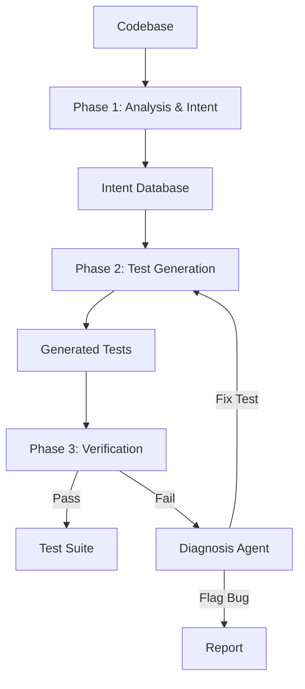

# Code2Test Architecture

**Code2Test** is designed around a three-phase pipeline: **Analysis & Intent**, **Test Generation**, and **Verification**. This architecture ensures that tests are not just syntactically correct but semantically meaningful and verified against the actual code.

## System Overview

## Phase 1: Analysis & Intent Extraction

This phase builds a semantic understanding of the codebase.

### Components
1.  **Dependency Graph Builder**: Uses `tree-sitter` to parse code and build a graph of component dependencies (functions, classes, modules).
2.  **Intent Extractor**: A multi-signal analysis engine that infers *what* a component does.
    *   **Inputs**: Docstrings, type hints, function names, and dependency usages.
    *   **Process**:
        *   Static analysis extracts explicit signals (e.g., docstrings).
        *   `IntentAgent` (LLM) synthesizes these signals into a clear "Intent Statement".
        *   Confidence scoring determines if human clarification is needed.
3.  **Intent Database**: A local SQLite database stores inferred intents. This allows for incremental generation and manual refinement.

## Phase 2: Test Generation

This phase translates intents into executable test code.

### Components
1.  **Test Generator**: The orchestrator that manages the generation lifecycle.
2.  **Test Agent**: An LLM-powered agent specialized in writing tests.
    *   It takes the Component Source + Inferred Intent + Dependencies.
    *   It produces test code using the project's framework (Pytest, Jest, or JUnit).
3.  **Template Engine**: Uses Jinja2 templates to ensure generated tests follow a consistent, idiomatic structure (imports, classes, fixtures).

## Phase 3: Verification & Refinement

This phase ensures quality and correctness.

### Components
1.  **Verifier**: Runs the generated tests in a sandboxed environment.
2.  **Diagnosis Agent**: If a test fails, this agent analyzes the failure output.
    *   **Classification**: Determines if the failure is due to:
        *   `TEST_WRONG`: The test code is incorrect (e.g., syntax error, wrong assertion).
        *   `CODE_BUG`: The implementation doesn't match the intent.
        *   `INTENT_WRONG`: The initial intent inference was incorrect.
    *   **Self-Healing**: If `TEST_WRONG`, it feeds the error back to the Test Agent to regenerate a fixed test.

## Key Modules

### `code2test.core`
The brain of the system.
-   `generator.py`: Orchestrates the 3-phase pipeline.
-   `intent.py`: Logic for extracting and scoring intents.
-   `verifier.py`: Wrapper around test runners (pytest, etc.).

### `code2test.agents`
The AI workers.
-   `intent_agent.py`: LLM interface for intent inference.
-   `test_agent.py`: LLM interface for writing test code.
-   `diagnosis_agent.py`: LLM interface for analyzing failures.

### `code2test.adapters`
Language-specific logic.
-   `python/`: Pytest adapter.
-   `javascript/`: Jest adapter.
-   `java/`: JUnit adapter.

### `code2test.cli`
The user interface.
-   `main.py`: Entry point.
-   `interactive.py`: Rich-based TUI for human-in-the-loop flows.
