### **1. The Ultimate Architecture (`final_arch.md`)**

I will now generate the definitive architecture document. It incorporates your detailed editing methodology into the `Surgical Healing System` and the `LearningEngine`, making them substantially more intelligent.

**File: `docs/arch/final_arch.md`**

# Ultimate Test Generation Architecture: The Best of All Worlds

## 🎯 **Core Philosophy: "Pragmatic Intelligence with Zero Waste"**

This architecture combines:
- **Specification-driven generation** (tests what SHOULD happen)
- **Code-aware validation** (understands what DOES happen)
- **Multi-modal, incremental healing** (chooses the right tool to fix only what's broken)
- **Tool orchestration** (leverages best-in-class solutions)
- **Fact-based generation** (zero hallucination)

---

## 🏗️ **System Architecture**

```mermaid
graph TD
    %% === STYLES ===
    classDef input fill:#e8f5e8,stroke:#4caf50,stroke-width:3px;
    classDef intelligent fill:#e3f2fd,stroke:#2196f3,stroke-width:3px;
    classDef existing fill:#fff3e0,stroke:#ff9800,stroke-width:2px;
    classDef novel fill:#f3e5f5,stroke:#9c27b0,stroke-width:3px;
    classDef healing fill:#ffebee,stroke:#f44336,stroke-width:2px;
    classDef output fill:#e0f2f1,stroke:#009688,stroke-width:3px;
    classDef state fill:#fce4ec,stroke:#e91e63,stroke-width:2px;

    %% === INPUT LAYER ===
    subgraph "📝 Multi-Source Truth"
        UserStories["📋 Business Requirements<br/>• User stories<br/>• Acceptance criteria"]:::input
        TechnicalSpecs["📄 Technical Specifications<br/>• API contracts (OpenAPI)<br/>• Type definitions"]:::input
        ExistingAssets["💻 Existing Assets<br/>• Source code<br/>• Git history<br/>• Current tests"]:::input
    end

    %% === INTELLIGENCE LAYER ===
    subgraph "🧠 Multi-Modal Intelligence Engine"
        FactExtractor["Fact Extraction Engine<br/>🎯 Zero-interpretation parsing<br/>🎯 Requirement analysis<br/>🎯 Code behavior mapping"]:::intelligent
        CrossValidator["Cross-Source Validator<br/>🔍 Spec ↔ Code alignment<br/>🔍 Requirement coverage gaps<br/>🔍 Implementation contradictions"]:::intelligent
        StrategyOrchestrator["Intelligent Strategy Orchestrator<br/>⚡ Risk-based prioritization<br/>⚡ Tool-to-task matching<br/>⚡ Failure prediction"]:::intelligent
    end

    %% === PROVEN TOOLS LAYER ===
    subgraph "🛠️ Best-in-Class Tool Ecosystem"
        direction LR
        subgraph Generation Tools
            Copilot["GitHub Copilot"]:::existing
            Cursor["Cursor IDE"]:::existing
            Hypothesis["Hypothesis PBT"]:::existing
        end
        subgraph Validation Tools
            MutationTest["Mutation Testing"]:::existing
            StaticAnalysis["Static Analysis"]:::existing
            ContractTest["Contract Testing"]:::existing
        end
    end

    %% === INCREMENTAL STATE LAYER ===
    subgraph "📊 Stateful Execution Engine"
        TestChecklist["Smart Test Checklist<br/>📋 Individual test states<br/>📋 Failure categorization<br/>📋 Healing history"]:::state
        ExecutionEngine["Incremental Execution Engine<br/>🎯 Run only failed tests<br/>🎯 Parallel execution<br/>🎯 State persistence"]:::novel
        HealingKB["Healing Knowledge Base<br/>🧠 Error → Fix Method mappings<br/>🧠 Success patterns<br/>🧠 Cross-project learning"]:::state
    end

    %% === HEALING LAYER ===
    subgraph "🏥 Tri-Modal Healing System"
        ErrorAnalyzer["AI-Powered Error Analyzer<br/>🔍 Root cause analysis<br/>🔍 Categorize error type<br/>🔍 Assess change scope"]:::healing
        SurgicalHealer["**Tri-Modal Healer**<br/>💡 Chooses method: `update`, `patch`, `rewrite`<br/>🔪 Prefers minimal change<br/>🔄 Safe fallbacks"]:::healing
        LearningEngine["Continuous Learning Engine<br/>🧠 Learns which healing method works best<br/>🧠 Optimizes fix strategies<br/>🧠 Improves failure prediction"]:::healing
    end

    %% === NOVEL COORDINATION LAYER ===
    subgraph "🎭 Smart Orchestration (Our Secret Sauce)"
        MultiToolRouter["Multi-Tool Smart Router<br/>🎯 Context-aware tool selection<br/>🎯 Parallel execution coordination<br/>🎯 Cost optimization"]:::novel
        QualityGate["Multi-Layer Quality Gate<br/>✅ Citation requirement<br/>✅ Business logic validation<br/>✅ Security checks"]:::novel
        HumanLoop["Human-in-the-Loop Controller<br/>👨‍💻 Approval workflows<br/>👨‍💻 Expert escalation<br/>👨‍💻 Quality oversight"]:::novel
    end

    %% === OUTPUT LAYER ===
    subgraph "📦 Production-Ready Deliverables"
        TestSuite["Self-Documenting Test Suite<br/>✅ Requirement traceability<br/>✅ Maintenance instructions"]:::output
        QualityReport["Comprehensive Quality Report<br/>📊 Coverage analysis<br/>📊 Risk assessment<br/>📊 Gap identification"]:::output
        AuditTrail["Complete Audit Trail<br/>📝 Generation decisions<br/>📝 Healing applications<br/>📝 Human approvals"]:::output
    end

    %% === CONNECTIONS ===
    UserStories & TechnicalSpecs & ExistingAssets --> FactExtractor --> CrossValidator --> StrategyOrchestrator
    StrategyOrchestrator --> MultiToolRouter --> Copilot & Cursor & Hypothesis --> QualityGate
    QualityGate --> MutationTest & StaticAnalysis & ContractTest --> ExecutionEngine
    ExecutionEngine --> TestChecklist --> ErrorAnalyzer
    ErrorAnalyzer --> SurgicalHealer
    SurgicalHealer --> HealingKB
    HealingKB --> LearningEngine
    LearningEngine --> StrategyOrchestrator & SurgicalHealer
    SurgicalHealer --> ExecutionEngine
    QualityGate & SurgicalHealer --> HumanLoop --> TestSuite
    ExecutionEngine --> TestSuite
    CrossValidator --> QualityReport
    LearningEngine --> AuditTrail
```



---

## 🎪 **The Magic: Tri-Modal Healing & Orchestration**

### **1. The Healing Decision Tree**
The agent's intelligence lies in *choosing the right tool*. It follows a clear decision path to determine the most efficient and least risky editing method.

```python
# The agent's internal logic for choosing a healing method
def choose_healing_method(error_analysis):
    """Decide which healing method to request from the LLM."""
    
    # Simple, localized error with a unique signature
    if (error_analysis.type in ["NameError", "ImportError"] and
        error_analysis.uniqueness_score == 1.0 and
        error_analysis.scope == "local"):
        return "request_update" # Most efficient

    # Changes involve multiple lines but are contained in one function
    elif (error_analysis.lines_to_change < 10 and
          error_analysis.locations == 1):
        return "request_patch" # Good for surgical multi-line edits

    # Structural changes, multiple locations, or complex errors
    else:
        return "request_rewrite" # Safest fallback
```

### **2. Incremental State with Healing Intent**
The `test_execution_state.yaml` now tracks not just the failure, but the *intended fix*, making the process transparent.

```yaml
# test_execution_state.yaml - The "Smart Checklist"
test_cases:
  - id: "test_process_payment_invalid_card"
    status: "FAILED"
    retry_count: 1
    last_error: "NameError: name 'CardValidationError' is not defined"
    error_category: "NAME_ERROR"
    # The ErrorAnalyzer's assessment:
    analysis:
      scope: "local"
      uniqueness_score: 1.0 # The string 'CardValidationError' is unique
      suggested_fix_method: "update" # Agent decides the best tool is a simple string replacement
    
  - id: "test_user_registration_logic"
    status: "FAILED"
    retry_count: 1
    last_error: "AssertionError: expected user status to be 'ACTIVE', got 'PENDING'"
    error_category: "LOGIC_ERROR"
    analysis:
      scope: "multi_line"
      uniqueness_score: 0.2 # The text is not unique
      suggested_fix_method: "patch" # A surgical patch is needed
      
  - id: "test_refactor_legacy_function"
    status: "FAILED"
    retry_count: 1
    last_error: "Multiple syntax and logic errors detected."
    error_category: "COMPLEX_FAILURE"
    analysis:
      scope: "file_wide"
      uniqueness_score: 0.0
      suggested_fix_method: "rewrite" # The file needs a full rewrite
```

### **3. The Tri-Modal Healing Payloads**
The `HealNode` will now be capable of requesting and handling three distinct types of fixes from the LLM.

**Type 1: `update` (The Scalpel)**
```yaml
reasoning: "The test failed due to a simple NameError. I will import the missing exception."
file_to_patch: "tests/test_payment.py"
update:
  old_str: "from payment.core import process_payment"
  new_str: "from payment.core import process_payment, CardValidationError"
```

**Type 2: `patch` (The Surgical Tool)**
```yaml
reasoning: "The logic for calculating tax is incorrect. I will adjust the rate and add a rounding function."
file_to_patch: "src/payment.py"
patch: |
  --- a/src/payment.py
  +++ b/src/payment.py
  @@ -25,5 +25,6 @@
   def calculate_tax(amount):
  -    tax = amount * 0.075
  -    return tax
  +    tax = amount * 0.088
  +    return round(tax, 2)
```

**Type 3: `rewrite` (The Full Transplant)**
```yaml
reasoning: "The original test file was missing multiple imports and used an outdated class structure. It is safer and cleaner to rewrite it."
file_to_patch: "tests/test_payment.py"
new_content: |
  import pytest
  from src.payment import PaymentService, PaymentError

  @pytest.fixture
  def payment_service():
      return PaymentService()

  def test_successful_payment(payment_service):
      assert payment_service.charge(100, "valid_token") is True
```
---

### **4. Implementation Roadmap**

The phased plan remains the same, but the content of Phase 2 becomes richer and more powerful.

*   **Phase 1: Foundation (Weeks 1-4)** - Core Generate & Verify Engine (`COMPLETED`)
*   **Phase 2: Tri-Modal Healing (Weeks 5-10)** - Implement the `update`/`patch`/`rewrite` logic. (`IN PROGRESS`)
*   **Phase 3: Multi-Modal Intelligence (Weeks 11-16)** - Ingest specs, generate behavioral tests.
*   **Phase 4: Full Orchestration (Weeks 17-20)** - Add multi-tool routing, quality gates, and human oversight.

This updated architecture is a significant leap forward. It creates a system that is not only autonomous but also adaptable, efficient, and aligned with the sophisticated reasoning an expert human developer would use.

---

### **2. Updated Implementation Phases (`docs/plan/final_arch.md`)**

Here is the updated, actionable plan reflecting the new architecture.

**File: `docs/plan/final_arch.md`**

---

### **Implementation Phases: From Core Engine to Ultimate Architecture**

| Phase | Title | Core Focus | Key `final_arch.md` Components | Pocket Flow Pattern |
| :--- | :--- | :--- | :--- | :--- |
| **Phase 1** | The Core Generate & Verify Engine | Statefully generate and run individual tests, recording pass/fail status. | `Smart Test Checklist`, `Incremental Execution Engine` | `Workflow`, `Batch` |
| **Phase 2** | **The Tri-Modal Healing System** | **Autonomously fix failing tests using a hybrid `update`, `patch`, or `rewrite` strategy.** | `Tri-Modal Healing System`, `Healing Knowledge Base` | `Agent` |
| **Phase 3** | The Multi-Modal Intelligence Engine | Incorporate specifications (user stories, API contracts) to generate behavior-driven tests. | `Multi-Source Truth`, `Fact Extractor`, `Cross-Validator` | `RAG` |
| **Phase 4** | Full Orchestration & Enterprise Readiness | Add multi-tool routing, quality gates, human oversight, and cross-project learning. | `Smart Orchestration`, `Best-in-Class Tools`, `Learning Engine` | `Async`, `Multi-Agent` |

---

### **Phase 1: The Core Generate & Verify Engine (The MVP)**

**Goal:** To build the fundamental "spine" of the system.
**Status: `COMPLETED`**

---

### **Phase 2: The Tri-Modal Healing System (Next Step)**

**Goal:** To implement the intelligent, three-tiered healing mechanism, allowing the agent to choose the most effective fix for any given error.

**Actions:**

1.  **Upgrade `HealNode` Prompt to be Tri-Modal**:
    *   Modify the prompt in `HealNode.exec()` to instruct the LLM to analyze the error and respond with a YAML structure containing **one of three keys**: `update`, `patch`, or `new_content`.
    *   Provide clear examples of all three formats in the prompt to guide the LLM's response.

2.  **Implement the Tri-Modal Handler in `HealNode.post_async()`**:
    *   Refactor the `post_async` logic into an `if/elif/else` block that checks for the presence of `update`, `patch`, or `new_content` in the LLM's response.
    *   **`if 'update' in response`**:
        *   Implement the "scalpel" logic.
        *   Retrieve `old_str` and `new_str` from the response.
        *   Fetch the current file content.
        *   **Crucially, verify that `current_code.count(old_str) == 1`**. If not, fail the heal attempt and force a retry (where the LLM will likely choose `patch` or `rewrite` next time).
        *   If validation passes, perform the `current_code.replace(old_str, new_str, 1)` operation.
    *   **`elif 'patch' in response`**:
        *   Implement the "surgical tool" logic.
        *   This will reuse our existing, robust `patch` utility handler. No new logic is needed here, just placing it in the `elif` block.
    *   **`elif 'new_content' in response`**:
        *   Implement the "full transplant" logic.
        *   This is the simplest case: directly overwrite the in-memory file content with the `new_content` string.

3.  **Enhance the Learning Mechanism (`HealingKB`)**:
    *   When a fix is successful, the final node in the healing flow will now record not just the fix itself, but the *method* that worked.
    *   Example log: `({error: "NameError"}, {code_context}) -> {method: "update", success: true}`.
    *   This builds a rich dataset for the `LearningEngine` to later predict the best healing strategy from the start.

**Status: `PENDING`** - This is our immediate focus.

---

### **Phase 3 & 4**
The goals for these phases remain the same, but they will be built upon a much more robust and intelligent Phase 2 foundation.
**Status: `PENDING`**